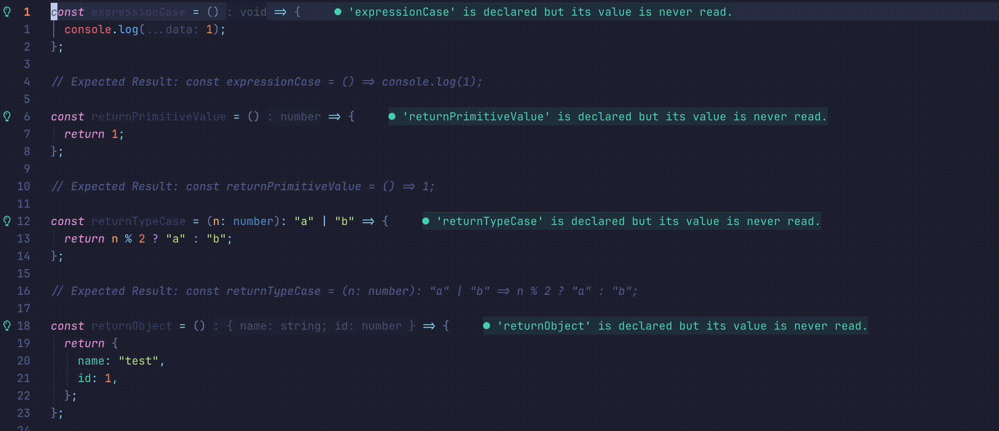

<p align="center">
  <h1 align="center">js.nvim</h2>
</p>

<p align="center">
    Refactoring features and snippets for JavaScript development. Inspired by WebStorm.
</p>

<div align="center">
    
</div>


## ⚡️ Features

- Remove braces around arrow function body

**Supported filetypes:** JavaScript, TypeScript, JavaScriptReact, TypeScriptReact

## 📦 Requirements

- Neovim >= v0.11
- [none-ls](https://github.com/nvimtools/none-ls.nvim) (required for code actions)

## 📋 Installation

<div align="center">
<table>
<thead>
<tr>
<th>Package manager</th>
<th>Snippet</th>
</tr>
</thead>
<tbody>
<tr>
<td>

[wbthomason/packer.nvim](https://github.com/wbthomason/packer.nvim)

</td>
<td>

```lua
-- stable version
use {"js.nvim", tag = "*" }
-- dev version
use {"js.nvim"}
```

</td>
</tr>
<tr>
<td>

[junegunn/vim-plug](https://github.com/junegunn/vim-plug)

</td>
<td>

```lua
-- stable version
Plug "js.nvim", { "tag": "*" }
-- dev version
Plug "js.nvim"
```

</td>
</tr>
<tr>
<td>

[folke/lazy.nvim](https://github.com/folke/lazy.nvim)

</td>
<td>

```lua
-- stable version
{ "js.nvim", version = "*" }
-- dev version
{ "js.nvim" }
```

</td>
</tr>
</tbody>
</table>
</div>

## ☄ Getting started

The plugin automatically integrates with none-ls. Code actions will appear when your cursor is on an arrow function that can be refactored.

**Basic none-ls setup:**

```lua
local null_ls = require("null-ls")

null_ls.setup({
    sources = {
        -- js.nvim registers automatically
    },
})
```

**Usage:**
1. Place cursor on arrow function
2. Trigger code action (default: `<leader>ca` or via LSP menu)
3. Select "Remove braces around arrow function body"

## ⌨ Contributing

PRs and issues are always welcome. Make sure to provide as much context as possible when opening one.

