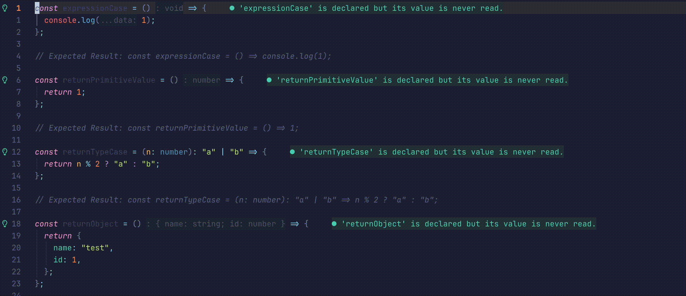

<p align="center">
  <h1 align="center">js.nvim</h2>
</p>

<p align="center">
    Refactoring features and snippets for JavaScript development. Inspired by WebStorm.
</p>

<div align="center">
    
</div>


## ⚡️ Features

**Code Actions:**
- Remove braces around arrow function body
- Convert function to arrow function

**Snippets:**
- `.const` postfix snippet - transforms expressions into const declarations
- `.log` postfix snippet - wraps expressions in console.log
- `.await` postfix snippet - adds await operator to expressions

**Supported filetypes:** JavaScript, TypeScript, JavaScriptReact, TypeScriptReact

## 📦 Requirements

- Neovim >= v0.11
- [none-ls](https://github.com/nvimtools/none-ls.nvim) (required for code actions)
- [LuaSnip](https://github.com/L3MON4D3/LuaSnip) (optional, required for snippets)

## 📋 Installation

<div align="center">
<table>
<thead>
<tr>
<th>Package manager</th>
<th>Snippet</th>
</tr>
</thead>
<tbody>
<tr>
<td>

[wbthomason/packer.nvim](https://github.com/wbthomason/packer.nvim)

</td>
<td>

```lua
-- stable version
use {"js.nvim", tag = "*" }
-- dev version
use {"js.nvim"}
```

</td>
</tr>
<tr>
<td>

[junegunn/vim-plug](https://github.com/junegunn/vim-plug)

</td>
<td>

```lua
-- stable version
Plug "js.nvim", { "tag": "*" }
-- dev version
Plug "js.nvim"
```

</td>
</tr>
<tr>
<td>

[folke/lazy.nvim](https://github.com/folke/lazy.nvim)

</td>
<td>

```lua
-- stable version
{ "js.nvim", version = "*" }
-- dev version
{ "js.nvim" }
```

</td>
</tr>
</tbody>
</table>
</div>

## ☄ Getting started

### Code Actions

The plugin automatically integrates with none-ls. Code actions will appear when your cursor is on an arrow function that can be refactored.

**Basic none-ls setup:**

```lua
local null_ls = require("null-ls")

null_ls.setup({
    sources = {
        -- js.nvim registers automatically
    },
})
```

**Usage:**
1. Place cursor on function
2. Trigger code action (default: `<leader>ca` or via LSP menu)
3. Select desired action:
   - "Remove braces around arrow function body" - simplifies arrow function
   - "Convert to arrow function" - converts regular function to arrow function

### Snippets

The plugin automatically integrates with LuaSnip. Postfix snippets are available when LuaSnip is installed.

**`.const` postfix snippet:**

Type `.const` after any expression to transform it into a const declaration.

Examples:
```javascript
// Simple values
123.const          → const | = 123
"hello".const      → const | = "hello"

// Expressions
foo.bar().const    → const | = foo.bar()
a + b.const        → const | = a + b

// Multiline objects
{
  a: 1,
  b: 2
}.const            → const | = {
                       a: 1,
                       b: 2
                     }
```

The cursor (`|`) is positioned at the variable name for immediate typing.

**`.log` postfix snippet:**

Type `.log` after any expression to wrap it in console.log.

Examples:
```javascript
// Binary expressions
1 + 2.log                    → console.log(1 + 2)

// Method chains
user.getName().log           → console.log(user.getName())

// Arrow function bodies
[1,2,3].map((n) => n.log)    → [1,2,3].map((n) => console.log(n))
```

**`.await` postfix snippet:**

Type `.await` after any expression to add await operator.

Examples:
```javascript
// Function calls
fetchData().await            → await fetchData()

// Binary expressions
promise1 + promise2.await    → await (promise1 + promise2)
```

## ⌨ Contributing

PRs and issues are always welcome. Make sure to provide as much context as possible when opening one.

